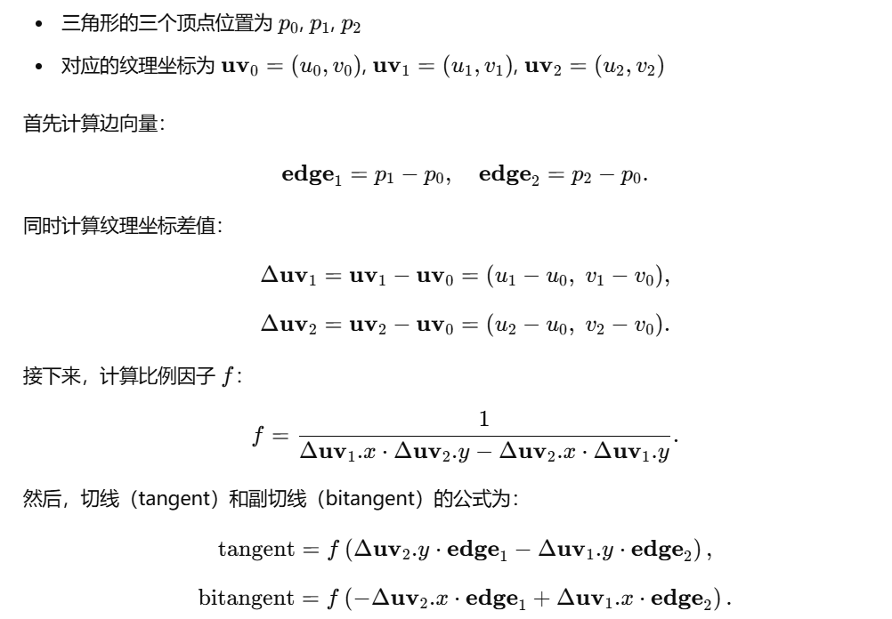

##
函数调用逻辑:
1. 选择积分器
auto integrator = Factory::construct_class<Integrator>(json["integrator"]);
torus:normal
bunny:directSampleLight
...
在Factory.h中将
REGISTER_CLASS(NormalIntegrator, "normal") 所以torus会采用NormalIntegrator

NormalIntegrator   ---->scene.rayIntersect---->   acceleration->rayIntersect(json中选择加速结构 linear)   ---->求交rayIntersect 和 填色fillIntersection

LinearAcceleration::rayIntersect  ---->遍历每个物体,计算rayIntersectShape

REGISTER_CLASS(TriangleMesh, "triangle") 所以 rayIntersect 和 fillIntersection 调用的都是 TriangleMesh::function

rayIntersect是acceleration类的成员函数, rayIntersectShape 和 fillIntersection 是 Shape的成员函数,但是linear加速类中的rayIntersect会调用rayIntersectShape

TriangleMesh类中存在成员变量acceleration ,TriangleMesh内部的加速结构函数 initInternalAcceleration 会遍历每个三角面片,在linear build的时候完成初始化

TriangleMesh内部的加速器调用rayIntersect,会遍历所有Triangle

2. 