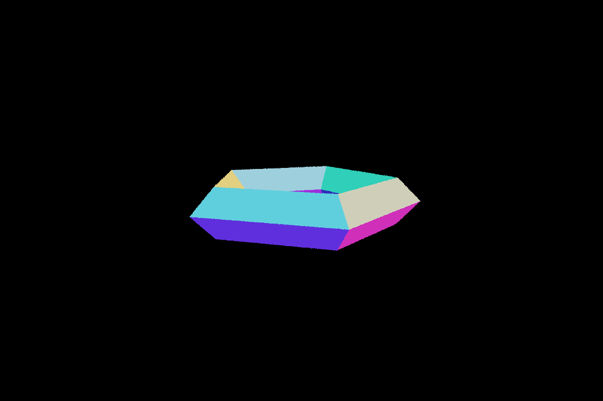
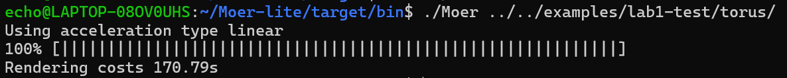
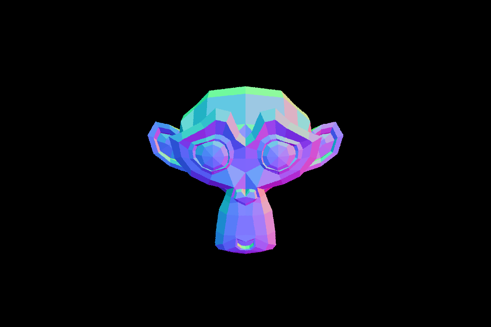
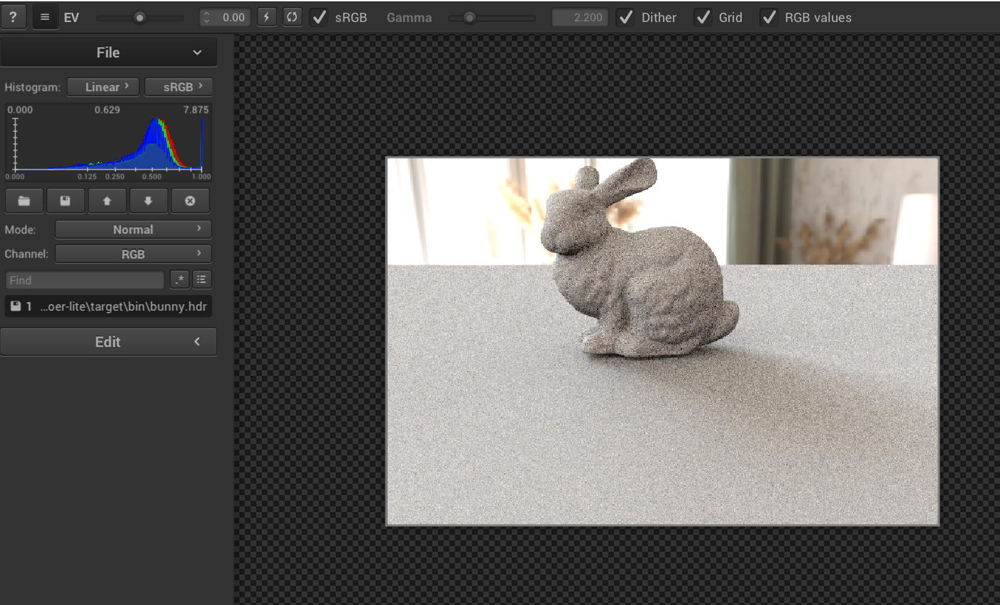

##
1. 三角形求交
函数调用逻辑:
选择积分器
auto integrator = Factory::construct_class<Integrator>(json["integrator"]);
torus:normal
bunny:directSampleLight
...
在Factory.h中将
REGISTER_CLASS(NormalIntegrator, "normal") 所以torus会采用NormalIntegrator

NormalIntegrator   ---->scene.rayIntersect---->   acceleration->rayIntersect(json中选择加速结构 linear)   ---->求交rayIntersect 和 填色fillIntersection

LinearAcceleration::rayIntersect  ---->遍历每个物体,计算rayIntersectShape

REGISTER_CLASS(TriangleMesh, "triangle") 所以 rayIntersect 和 fillIntersection 调用的都是 TriangleMesh::function

rayIntersect是acceleration类的成员函数, rayIntersectShape 和 fillIntersection 是 Shape的成员函数,但是linear加速类中的rayIntersect会调用rayIntersectShape

TriangleMesh类中存在成员变量acceleration ,TriangleMesh内部的加速结构函数 initInternalAcceleration 会遍历每个三角面片,在linear build的时候完成初始化

TriangleMesh内部的加速器调用rayIntersect,会遍历所有Triangle

三角形求交推导:https://zhuanlan.zhihu.com/p/651931015

效果图:

2. boundingbox
AABB 并不是acceleration的子类
思考:主场景拥有加速结构，每个 mesh 都会拥有自己的加速结构
这样设计代码逻辑更清晰,三角面片组成的物体和其他基元作为并列结构.而且在BVH中如果把三角面片作为遍历基元的话会导致二叉树叶子节点很多,影响效率
AABB推导:计算光线 在对应两个面进出包围盒的时间，更新光线与包围盒相交 最小相交时间与最大相交 时间。光线与包围盒没有相交当且仅当最小相交时间大于最大相交时间。

3. BVH build

trianglemesh类的加速结构是什么时候构造的:
在trianglemesh类中,initInternalAcceleration函数会创建加速器,并将每个面片作为基元添加到该加速器中.
对于整个场景的加速器,在scene.cpp构造函数中会遍历每个基元,使用attachShape,至此acceleration实例对象中存储了场景的所有基元.
在linear加速器中,build函数遍历每个基元,并初始化加速器initInternalAcceleration,也就意味着每个加速器在build中都需要遍历基元初始化基元的加速器.
而scene.cpp构造函数中设置了静态成员变量accelerationType为相应的加速器,比如BVH,到每个基元创建自己的加速器createAcceleration时,仍然用的是这个变量,也就是说json中设置的加速器对于所有基元和所有面片都是一样的.
上述印证了注释中的话

